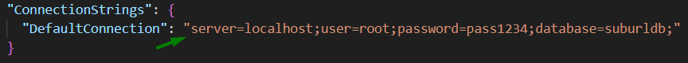

# SubUrl

## How to start the project?

1. **Set** your line to connect with Db in *appsettings.json*:

    

2. **Create** Db by migrations:

    `dotnet ef database update`

3. **Build** and **Run** the project:

    `dotnet watch run`
