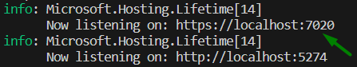

# SubUrl

## How to start the project (In VS Code)?

1. **Set** your line to connect with Db in *appsettings.json*:

    

2. **Build** and **Run** the project:

    `dotnet run`

3. **Start** the project - click to link:

    